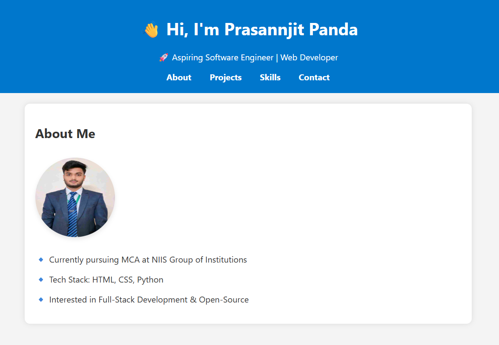

# 🚀 Prasannjit Panda - Portfolio Website

This is my **personal portfolio website**, built using HTML, CSS, and JavaScript.  
It highlights my skills, education, and projects as a software developer.

🌐 Live Website: [ https://prasannjitpanda.github.io/my-portfolio/]( https://prasannjitpanda.github.io/my-portfolio/)

---

## 📌 Key Sections

- 👨‍💻 About Me  
- 🛠️ Skills  
- 🎓 Education  
- 💼 Projects  
  - ✅ Todo List App  
  - 💪 Fitness & Wellness Website

---

## 📁 Technologies Used

- HTML5  
- CSS3  
- JavaScript  
- Git & GitHub  
- GitHub Pages (for deployment)

---

## 🖼️ Screenshots

---

## 📬 Contact

- 📧 Email: rahulprasannjit@gmail.com  
- 📍 Location: Kendrapara, Odisha  
- 🔗 LinkedIn: [Prasannjit Panda](https://www.linkedin.com/in/prasannjit-panda-469089296)

---
